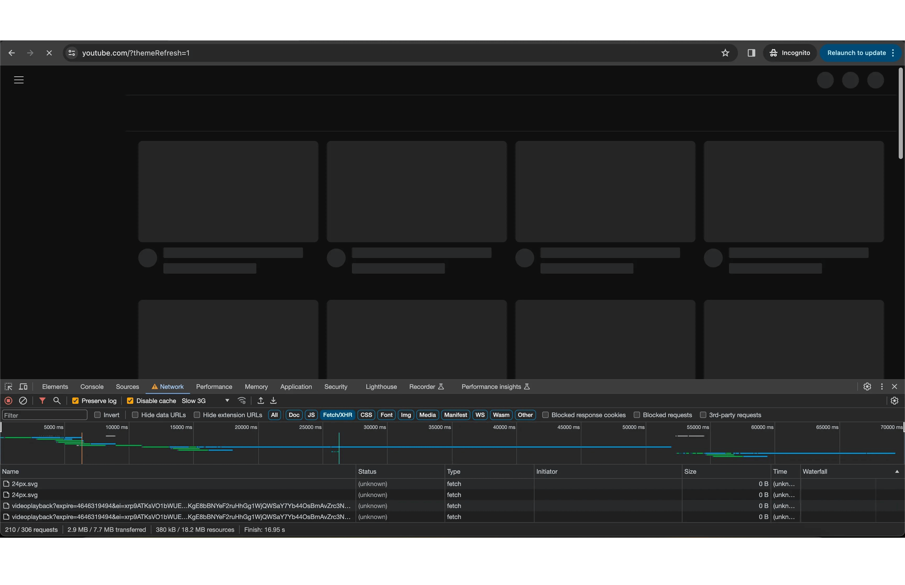
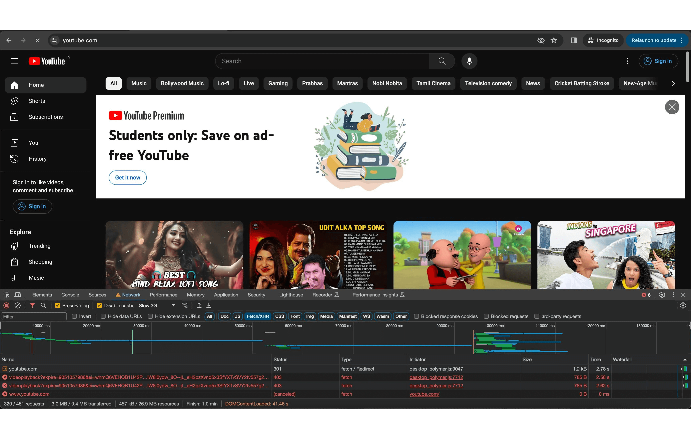
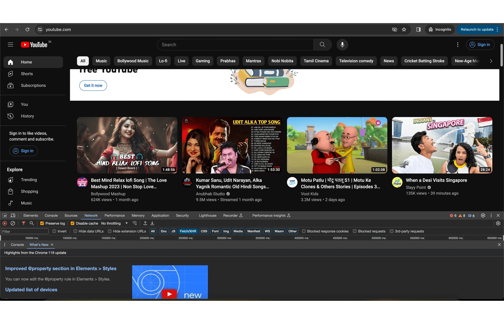
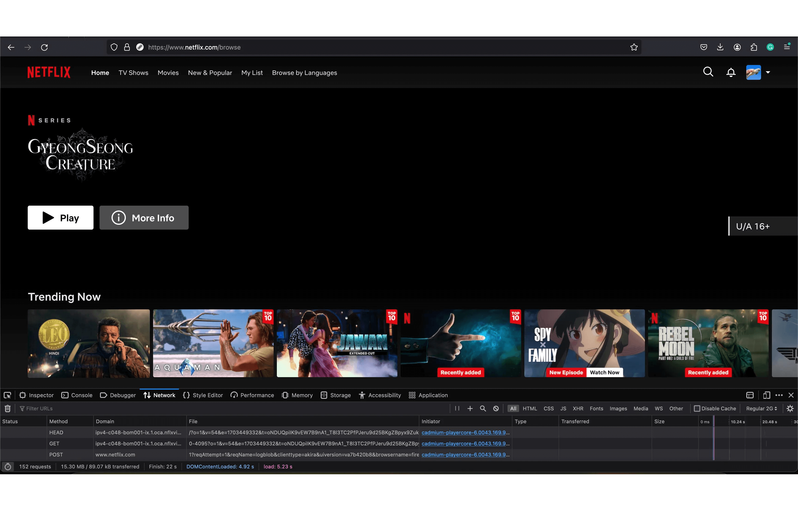

# Sample- Design a video streaming app like youtube

Video streaming platforms are one of the most challenging web apps to develop. You can find resources that talk about designing the backend (all the major resources are for the backend only), but there is hardly any resource that talks about designing the frontend system.

Real-life examples:
- Youtube
- Netflix
- Amazon Prime
- Disney + Hotstar
- Jio Cinema

From your favorite stand-up comedy to your favorite anime to your favorite sport, we can binge-watch all this from the comfort of any device and live thanks to the video streaming platforms.

Video streaming platforms are engineering marvels where the backend and frontend are equally difficult to design and develop as we have to deal with multiple complexities such as video encoding, adaptive streaming, content delivery networks, user interface design, and more.

In designing the frontend system of a video streaming platform like Youtube, it is crucial to prioritize a seamless user experience with intuitive navigation, responsive layouts, and fast loading times. Additionally, incorporating features like personalized recommendations, user-generated content interactions, and social sharing functionalities can enhance user engagement and retention on the platform.

It is a vast topic to be covered in this article. Rather, we will just cover the important things that are at the core of the frontend or the web app of any video streaming platform.

## Requirements:
Create a video streaming platform like YouTube or Amazon Prime where the user can browse through the recommendations, search for or query the videos, and play them.

## Core features:
- Browse the genre-categorized list (home page).
- Recommendation list (single video page).
- Video playback.
- Autoplay video on the user interaction, like hover.

## Nice-to-have features:
- To provide users with the best experience, they should be able to stream low-quality videos on the flaky networks.
- The webapp should be primarily built for the desktop but should support mobile and tablet-responsive views.
- Minimize stuttering and buffering.
- Fast (video startup time)[https://www.mux.com/blog/the-video-startup-time-metric-explained#why-video-startup-time-matters]

A video streaming platform can be split into two different parts, each of which could be tackled independently.

- Video player or video playback feature: The core of any video streaming website.
- Website, excluding the video playback: The skeleton of the video streaming website.

We will first design the website's skeleton, and then we will discuss the design of the video player. This will help us cover all the features.

## Designing the skeleton of the video streaming website
### Requirements
- A browse page to view the videos by genre.
- A single video page that will have the video details and the recommendation list.
- The webpage should be responsive for mobile and tablet screen sizes and primarily designed for the desktop.

### Architecture
A video streaming website heavily relies on SEO for growth and business, so the rendering strategy that will have to be applied should provide optimal SEO results. At the same time, video streaming websites are also very performance-intensive, so we have to keep them fast.

We can use any JavaScript framework that provides incremental static re-rendering, like (Nextjs)[https://nextjs.org/] or (NuxtJs)[https://nuxt.com/], for developing the web app.

Youtube uses server-side rendering with the 3-tier rendering strategy of "as little as possible, as early as possible," (popularized by Facebook)[https://engineering.fb.com/2020/05/08/web/facebook-redesign/]. Delivering only what we require is important, and we should aim to have the resources arrive just in time.

It splits the rendering into three parts:

In the first part, YouTube renders the skeleton UI on the server side, which loads the page extremely fast with all the necessary SEO meta and adhering to the core web vitals.



In the second part, it hydrates the skeleton UI with the video meta's like the text and the thumbnail, which are included in a JavaScript bundle.

When hovering over the video, you won't see the video duration, as it is just an image placeholder.



And after that, the playback bundle of JavaScript is loaded parallely, which handles all user actions and hydrates the video cards with the video details so that they can be played on hover.



You can review the same by running YouTube.com in slow 3G network throttling.

Netflix, on the contrary, renders the HTML page with all the images and video meta data populated.



You will notice that on the slow network, the video thumbnails are still there, but once JavaScript is loaded and parsed, the images will scale on hover and the video will be autoplayed.

Examining both popular websites, it is clear that we can use server-side rendering along with progressive and selective hydration to get optimal results. Images can be pre-loaded so that they can be visible as early as possible.

What and how you want to do the hydration is completely subjective and comes from the various experiments and lots of researchs within the organizations.

This will provide us with the fast load time of client-side rendering and better SEO because of server-side rendering, providing a great experience to the users.

We are going to rely heavily on client-side caching for this type of application.

On the homepage of Netflix, except for the recommendation list and the new arrivals that can be updated frequently, all the genre lists can be cached for a given amount of time to boost performance.

Similary, the preference, the theme, and the settings of the website can be cached to avoid round-trips to the server.

Thus, we can use React-Query for query caching and Zustand or Redux for state management.

We can perform state management using the unidirectional flow of the Flux architecture, which Zustand and Redux both use.

Zustand provides a more native experience with hooks, making it easier to work with. Redux with the toolkit can also achieve the same, but it could become complex to scale the state.

The video list and recommendations can be in the shared state, while the video playback data will be in the local state as they will be specific to each video.

Given that all major video streaming platforms follow a design system for consistency and to provide the same user experience across different platforms, we can adopt the same.

All the components can be styled using styled-components, which helps to write CSS in JavaScript, making it easier to extend or mutate the styles of the existing components.

But you can also choose to have a separate style sheet for your application.

Because we have to create a responsive application, we can follow the approach of progressive enhancement while styling, which enforces mobile-first development and progressively updating the styles for different screen sizes. This results in less CSS.

If you are opting for the desktop first approach, you do the graceful degradation of the style, in which you will have to override the styles for lower screen sizes.

Learn about 3 different ways to write CSS in React.

It is important to focus on accessibility and internationalization during component creation and styling so that each component is designed to provide the best user experience and support different languages and typographies.

Accessibility refers to the practice of making web content and applications usable for people with disabilities, ensuring that all users can access and navigate through the components easily. This includes considerations such as providing alternative text for images, using proper semantic markup, and ensuring keyboard accessibility.

Internationalization, on the other hand, involves adapting the components to different languages and cultural preferences, allowing users from various regions to understand and interact with the content effectively. By incorporating accessibility and internationalization into component creation and styling, developers can create inclusive.

The website should be accessible to all the different types of users with disabilities through keyboard, mouse, touch devices, and screen readers.

Similarly, users from different demographics and languages should also be supported. All types of fonts (Japanese is the most challenging language to handle as they write from top to bottom). We should also be able to provide support to the languages that are written from right to left, like Hebrew, Arabic, and Urdu.

From the requirements for the website, we can finalize the routes that we are going to need in the application.

To design the current system, we will need only two routes.

- Home or Browse page (/): It will display the new arrival list, the recommended video list, and the videos by genre.

- Single video page (/watch?video="video-slug"): This will show the single video details along with the video playback and suggestion list.

The reason why the single video page is taking the video URL as a query parameter on the watch page is that we can also pass additional details in the parameter, like whether the video is subtitled or not, the time from which the video should start playing, etc.

You can have it as a request parameter /watch/:video-slug?q="" which is also fine.

Depending on the platform, we can have public as well as private pages that require the user to be authenticated to access them. For example, in Netlfix, we can browse the homepage and see a part of the video or trailer, but we will have to login for full access.

We can define outlets in React-Router-V6 to redirect the routes if not authroized.

privateRoutes.js
```JavaScript
import React from "react";
import { Outlet, Navigate } from "react-router-dom";
import useStore from "../store/user";

const Private = () => {
  const isLoggedIn = useStore((state) => state.isLoggedIn);
  return isLoggedIn ? <Outlet /> : <Navigate to="/login" />;
};

export default Private;
```

publicRoutes.js
```JavaScript
import React from 'react';
import { Outlet, Navigate } from 'react-router-dom';
import  useStore  from '../store/user';

const Public = () => {
  const isLoggedIn = useStore((state) => state.isLoggedIn);
  return !isLoggedIn ? <Outlet /> : <Navigate to="/dashboard" />;
};

export default Public;
```

route.js
```JavaScript
import { BrowserRouter, Routes, Route } from "react-router-dom";
import Login from "./pages/login";
import Signup from "./pages/signup";
import PrivateRoutes from "./routes/private";
import PublicRoutes from "./routes/public";

const App = () => {
  return (
    <BrowserRouter>
      <Routes>
        <Route path="/" element={<PublicRoutes />}>
          <Route index element={<h1>Browse</h1>} />
          <Route path="login" element={<Login />}></Route>
          <Route path="signup" element={<Signup />}></Route>
        </Route>
        <Route path="/" element={<PrivateRoutes />}>
          <Route path="dashboard" element={<h1>Dashboard</h1>}></Route>
        </Route>
        <Route path="*" element={<NotFound />} />
      </Routes>
    </BrowserRouter>
  );
};

export default App;
```