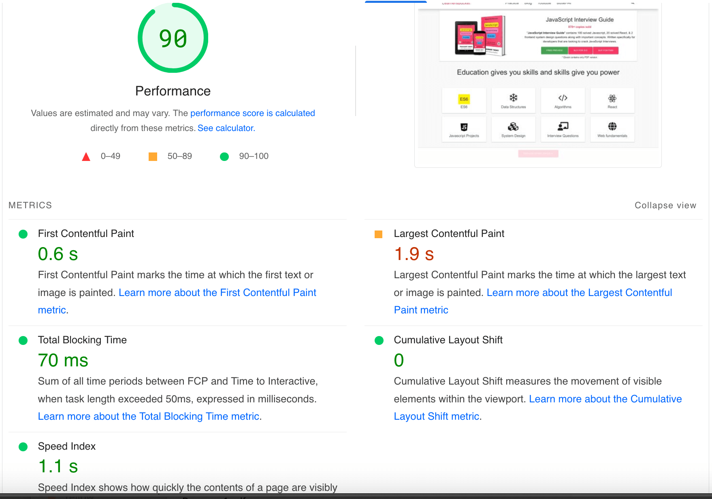
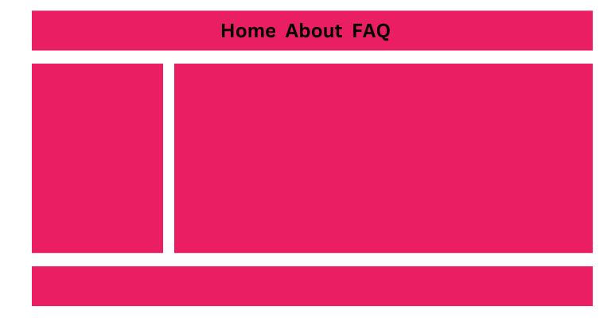
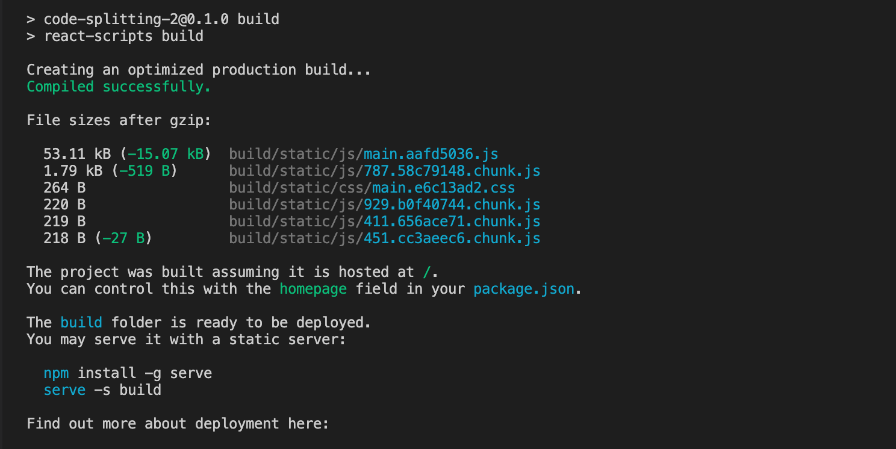
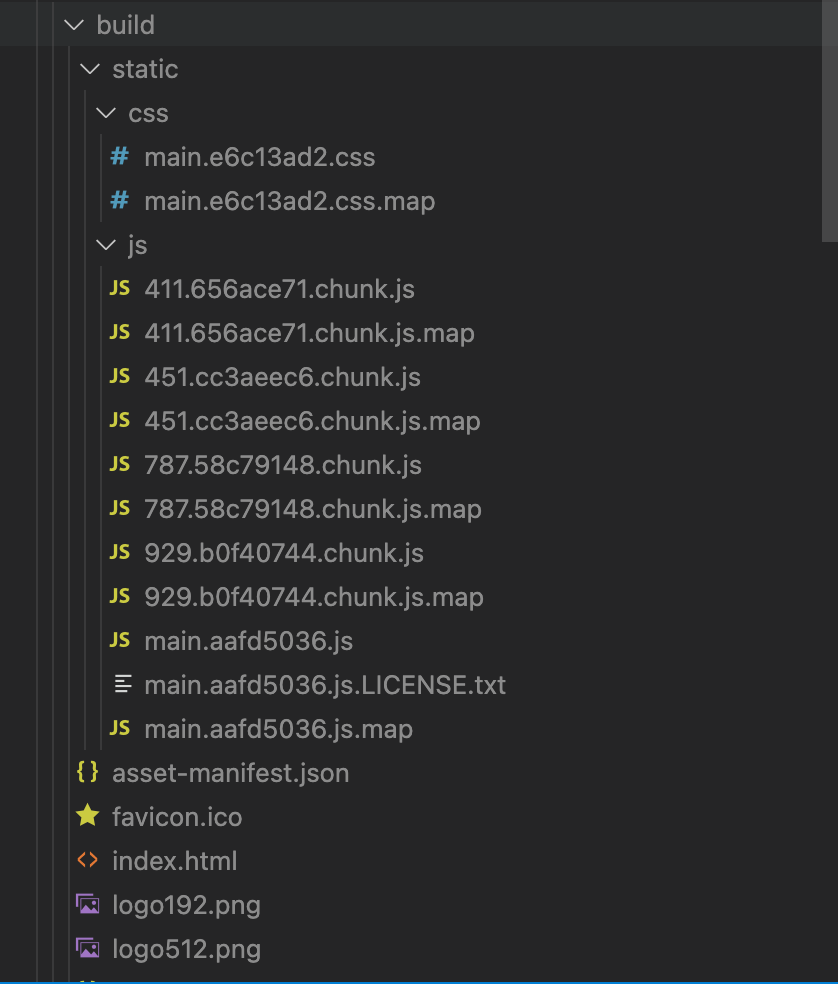

# Code Splitting
Let us learn about code splitting and understand how it helps to load websites faster.Why is code-splitting necessary?

## Why is code-splitting necessary?
Modern frontend frameworks have really boosted the development speed at which the websites are being built with all the necessary boilerplates pre-defined and developers have to just focus on the business logic.

The Client-Side rendering approach is where the static files will be loaded once and then all the UI update logic will be abstracted to the client itself and only data will be fetched from the server. Depending upon the data, the UI will be dynamically rendered or changed, even the routing logic resides on the client side.Though this has really made the web apps blazing fast, because the whole UI update and change is happening on the client side, the amount of Javascript code needed has increased.

Though this has really made the web apps blazing fast, because the whole UI update and change is happening on the client side, the amount of Javascript code needed has increased.Contrary to server-side rendering where the HTML was generated by the server and transferred over the network for the browser to display them and minor UI changes with JavaScript, now with the client-side approach the whole HTML is generated on run-time.

Contrary to server-side rendering where the HTML was generated by the server and transferred over the network for the browser to display them and minor UI changes with JavaScript, now with the client-side approach the whole HTML is generated on run-time.To generate the complete HTML on demand, libraries such as React and ReactDOM are used along with React-Router-DOM to manage the routing on the client and many other third-party libraries that will be required for the web applications.

To generate the complete HTML on demand, libraries such as React and ReactDOM are used along with React-Router-DOM to manage the routing on the client and many other third-party libraries that will be required for the web applications.

Shipping all this amount of code, along with the polyfills, heavily increases the bundle size.

A 2018 poll found that the [average javascript bundle size on mobile devices was 350 kb compressed](https://httparchive.org/reports/state-of-javascript#bytesJs); uncompressed, the size of the file is between 800 and 900 kb.

After transferring the 350kb compressed file, it will be uncompressed, parsed, and compiled in the browser which is an expensive thing for performance. This affects many metrics that impact the Search Engine Optimization like [Time To Interactive](https://developer.chrome.com/docs/lighthouse/performance/interactive), [First contentful paint](https://developer.chrome.com/docs/lighthouse/performance/first-contentful-paint/), etc.


## What is code-splitting and how does it help?
To solve this issue we can use the Code-Splitting technique that splits the JavaScript and CSS bundle into different bundles (chunks) so that they can be loaded in parallel and on demand.

Splitting the bundle into smaller files helps to separate the required and not-required things and lazy load the not-required things when they are required. Though it does not reduce the overall bundle size (perhaps increase it a bit), but being split in part helps to load and process them faster.

Often, there is one main bundle main.123455.js that loads initially, it holds all the core components that are required to load the website and then there is main.123455.js.map that holds the mapping details for other components on when they need to be loaded.

The code-splitting takes place when the production build is being created and the anatomy of the files looks like [name].[hash].js or [name].[hash].css.

  - name - Unique name of the file, which can be pulled from the component file name or can be randomly generated.
  - hash - A hash generated from the current timestamp to remove the caching from the bundle, so that browser knows new files are there and it has to be loaded.

Just like Tree-Shaking, the Webpack bundler provides the code-splitting feature under the hood and we can leverage this functionality and can configure it as per our requirements.

## Code-splitting in React
Let us try to understand the code splitting with a simple React web app example, suppose we have a web app with the following layout where there are three pages, Home, About, FAQ.



Create a new instance of React application using create-react-app.npx create-react-app code-splitting
```javascript
npx create-react-app code-splitting
```

The create-react-app boilerplate will include these dependencies, if you open the package.json, you will see them,
```javascript
"dependencies": {
  "@testing-library/jest-dom": "^5.16.5",
  "@testing-library/react": "^13.4.0",
  "@testing-library/user-event": "^13.5.0",
  "react": "^18.2.0",
  "react-dom": "^18.2.0",
  "react-scripts": "5.0.1",
  "web-vitals": "^2.1.4"
},
```

In these, @testing-library is only required during the development, and the remaining will be part of the production.

let us add the react-router-dom for client-side routing.
```javascript
npm i --save react-router-dom
```

Now that all the libraries are present, let's create the app. As per the image, we will have three pages, so let's create them.
```javascript
// Home.jsx
const Home = () => {
    return <h1>Home Page</h1>;
};

export default Home;
```

```javascript
// About.jsx
const About = () => {
    return <h1>About Page</h1>;
};

export default About;
```

```javascript
// FAQ.jsx
const FAQ = () => {
    return <h1>FAQ Page</h1>;
};

export default FAQ;
```

Now let's add these pages on their respective routes.
```javascript
// index.jsx
import React from "react";
import ReactDOM from "react-dom/client";
import "./index.css";
import reportWebVitals from "./reportWebVitals";
import { BrowserRouter, Routes, Route } from "react-router-dom";

const Home = React.lazy(() => import("./components/Home"));
const About = React.lazy(() => import("./components/About"));
const FAQ = React.lazy(() => import("./components/FAQ"));

const root = ReactDOM.createRoot(document.getElementById("root"));
root.render(
  <React.StrictMode>
    <BrowserRouter>
      <Routes>
        <Route
          index
          element={
            <React.Suspense fallback={<>Loading</>}>
              <Home />
            </React.Suspense>
          }
        />
        <Route
          path="about"
          element={
            <React.Suspense fallback={<>Loading</>}>
              <About />
            </React.Suspense>
          }
        />
        <Route
          path="faq"
          element={
            <React.Suspense fallback={<>Loading</>}>
              <FAQ />
            </React.Suspense>
          }
        />
      </Routes>
    </BrowserRouter>
  </React.StrictMode>
);

// If you want to start measuring performance in your app, pass a function
// to log results (for example: reportWebVitals(console.log))
// or send to an analytics endpoint. Learn more: https://bit.ly/CRA-vitals
reportWebVitals();
```

In these, if you see, we are lazy loading the component using React.lazy and providing a fallback using React.Suspense.

This helps to decide the code-splitting as the components need to be lazy-loaded on demand. Only the Home page component has to be loaded on the initial load.

Thus if you create a production build by running the command
```javascript
npm run build
```

In the build folder you will see multiple JavaScript files will be created, and the same for the CSS, if each component has a separate CSS file, multiple CSS files will also be created as you can see in the below image.





In these files, main.aafd5036.js holds the code of all the core components like React, React-DOM, react-router-dom as these are required every time.

But the pages can be loaded on demand, for example, we don't require the Home page component code on the About page and vice-versa which is why there are separated in different files.

As you can notice, each file is separated in its own chunk and they have their own sourceMappingURL, in this file, they have the list of other files that this chuck has a dependency on.

Similarly, the remaining files also have chunks that are not required at the initial load, and also CSS files are separated the same way.

If we remove the lazy loading of the component, you will notice the chuck reduces.

Now that components are not being lazy loaded, each component along with their dependencies is being loaded in a single file.

Thus it is very important to lazy load components, to provide Webpack the opportunity to do code-splitting ultimately boosting websites to load faster.