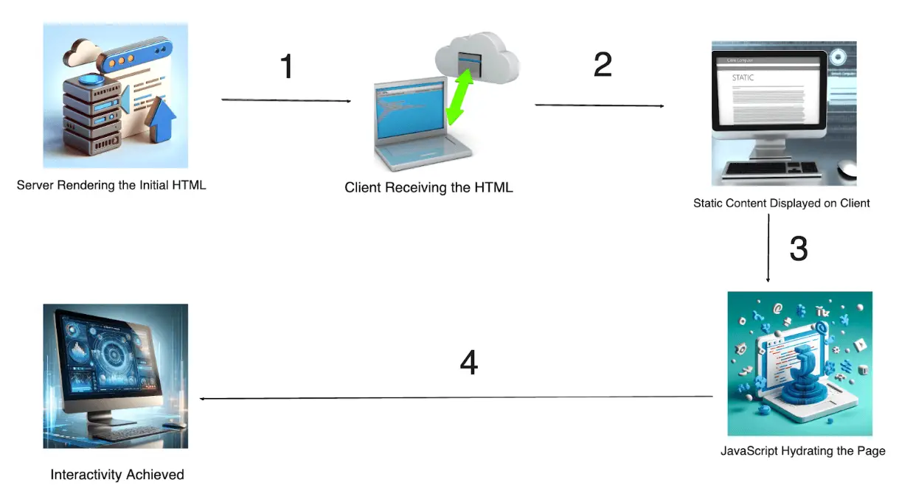
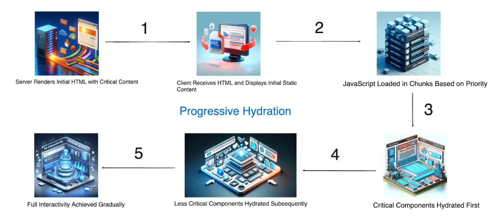
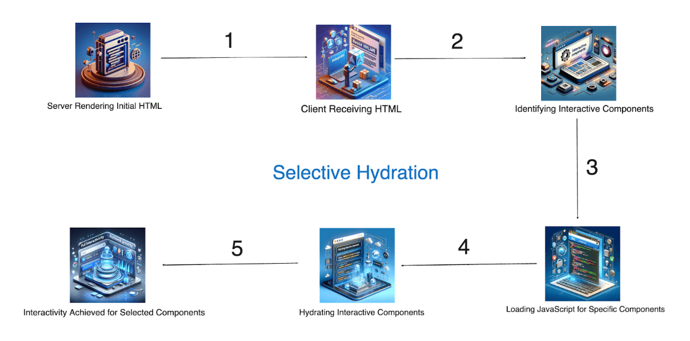

# Selective vs Progressive Hydration

## Overview of Hydration in Web Development
Hydration in web development refers to the process where a client-side JavaScript framework takes over static HTML content that was rendered on the server. This process involves converting the static HTML into a fully interactive web application by attaching event listeners, re-rendering dynamic content, and initialising components.

Hydration is a crucial concept in the world of Single Page Applications (SPAs) and server-side rendering (SSR). It ensures that the content served to the user is both immediately viewable and interactive. When a user first loads a web page, they receive HTML content, which is then "hydrated" by JavaScript to make it interactive.

There are various hydration strategies, but the two primary ones are Progressive Hydration and Selective Hydration. Understanding these strategies and their implementations is key to optimising performance and user experience in modern web applications.

## Importance of Hydration in Modern Web Applications
Hydration plays a significant role in enhancing the performance, SEO, and overall user experience of web applications. Here’s why it is important:

**1. Improved Performance:**
- Hydration helps in delivering faster initial load times. By serving pre-rendered HTML from the server, users can see content faster compared to client-side rendering where the entire application needs to load and render in the browser.
- Once the initial content is visible, JavaScript hydrates the page to make it interactive, allowing for a smooth transition from static to dynamic content.

**2. Better SEO:**
- Server-side rendering (SSR) combined with hydration ensures that search engines can crawl and index the content of web pages effectively. This is crucial for better search engine optimization (SEO), as it makes the content available for indexing without waiting for client-side rendering.
- Search engines and social media platforms can accurately fetch metadata and content from the server-rendered HTML, improving the page’s visibility and shareability.

**3. Enhanced User Experience:**
- Hydration ensures that users experience a seamless transition from static to interactive content. Users can see the initial content quickly and start interacting with it without noticeable delays.
- It also allows for more sophisticated state management and interactivity within the web application, improving the overall user experience.

**4. Scalability:**
- Hydration allows web applications to scale effectively by offloading some rendering tasks to the server. This reduces the burden on client devices, especially those with limited processing power or slower internet connections.

## Understanding Hydration
### Definition and Concept
Hydration in web development refers to the process of taking a server-rendered HTML page and turning it into a fully interactive web application on the client side. When a user first requests a web page, the server sends down a static HTML document. This document is then "hydrated" by client-side JavaScript, which attaches event listeners, initialises components, and activates dynamic functionality, effectively bringing the page to life

In essence, hydration is the mechanism that bridges the gap between server-side rendering (SSR) and client-side interactivity. It allows web applications to deliver content quickly and then enhance it with dynamic behaviours, providing a seamless user experience.

## The Hydration Process in Web Applications
The hydration process can be broken down into several key steps:

1. When a request is made for a web page, the server generates the HTML content dynamically, often by rendering components and templates.
2. This server-rendered HTML is sent to the client's browser, which can display it immediately.
3. The browser receives and parses the HTML document, displaying the static content to the user.
4. At this stage, the page appears fully loaded, but it is not yet interactive.
5. Once the HTML content is displayed, the browser begins to download and execute the JavaScript files associated with the page.
6. This JavaScript code initialises the client-side framework (such as React, Vue, or Angular) and starts the hydration process.
7. The framework identifies components in the static HTML and attaches the necessary event listeners and state management logic.
8. Any dynamic content or interactive elements are re-rendered as needed, replacing the static placeholders with fully functional components.
9. The page is now fully interactive, with JavaScript managing the state and behaviour of various components.
10. Users can interact with the page just as they would with a fully client-rendered SPA, but with the added benefit of faster initial load times thanks to the server-rendered HTML.

## Benefits of Hydration
Hydration offers several significant benefits that enhance the performance and user experience of web applications:

1. By sending pre-rendered HTML from the server, users can see and read content almost immediately, even before the JavaScript has fully loaded and executed.
2. This reduces the time-to-first-byte (TTFB) and time-to-first-paint (TTFP), providing a quicker visual response for the user.
3. Search engines can crawl and index the server-rendered HTML more effectively than client-rendered content. This improves the visibility and ranking of web pages in search engine results.
4. Metadata and content are readily available to search engine bots, enhancing SEO performance.
5. Users experience a smooth transition from static content to interactive components without noticeable delays.
6. This approach can provide a more responsive and engaging user experience, especially on slower networks or less powerful devices.
7. Hydration allows for better scalability by distributing the rendering load between the server and the client.
8. Server-side rendering can handle the initial content generation, while client-side JavaScript focuses on enhancing interactivity, leading to more efficient resource utilisation.

## Progressive Hydration
### Definition and Concept
Progressive hydration is a technique used in web development to enhance the performance and interactivity of web applications. Unlike traditional hydration, which activates the entire page at once, progressive hydration incrementally hydrates sections of the page as needed. This approach ensures that critical parts of the web application become interactive first, improving the perceived performance and user experience.

The concept of progressive hydration revolves around prioritising the hydration of different parts of the page based on their importance and visibility. By doing so, it aims to deliver a more responsive and efficient user experience, especially on complex and large-scale web applications.

## How Progressive Hydration WorksProgressive hydration involves several steps to ensure that the most important parts of the web page are hydrated first:

Progressive hydration involves several steps to ensure that the most important parts of the web page are hydrated first:

- The server generates and sends the initial HTML content to the client. This content includes placeholders for interactive components.The HTML document includes scripts that will progressively hydrate different sections of the page.
- The HTML document includes scripts that will progressively hydrate different sections of the page.Upon receiving the HTML, the browser displays the static content.
- Upon receiving the HTML, the browser displays the static content.
- JavaScript begins by hydrating the critical sections of the page first. These sections are usually above-the-fold content or elements that are immediately visible to the user.
- After the critical sections are hydrated, JavaScript continues to hydrate the remaining parts of the page.
- This process can be prioritised based on user interactions, such as scrolling or navigating to different sections.
- When the browser is idle or has spare resources, the hydration process continues for less critical sections.
- This ensures that the entire page becomes fully interactive without affecting the user experience negatively.

## Advantages of Progressive Hydration
Progressive hydration offers several advantages that enhance the performance and user experience of web applications:
- By prioritising the hydration of critical sections first, users can interact with important parts of the page sooner.
- This reduces the time-to-interactive (TTI) and provides a faster, more responsive experience.
- Users experience a smoother transition from static to interactive content, especially on pages with complex layouts and numerous components.
- The incremental approach ensures that the most important content is available and interactive as quickly as possible.
- Progressive hydration makes better use of browser resources by spreading the hydration workload over time.
- This approach reduces the initial rendering load, making the application more efficient and responsive.
- Progressive hydration scales well with large and complex applications, where hydrating the entire page at once would be resource-intensive and slow.
- It allows developers to optimise the hydration process based on the specific needs of the application and its users.

## Challenges and Considerations
While progressive hydration offers many benefits, it also comes with its own set of challenges and considerations:
- Implementing progressive hydration requires careful planning and prioritisation of components. Developers need to identify and prioritise critical sections effectively.
- The process involves more intricate JavaScript logic and state management to handle the incremental hydration.
- The server needs to include logic for prioritising and marking critical sections, which can add to the initial load time.
- This overhead needs to be balanced against the benefits of faster interaction times.
- There is a risk of inconsistencies if some parts of the page are interactive while others are not yet hydrated. This can lead to a fragmented user experience.
- Developers must ensure that the user interface remains consistent and usable throughout the hydration process.
- Different browsers may handle hydration processes differently, leading to potential issues in cross-browser compatibility.
- Testing across multiple browsers and devices is crucial to ensure a seamless experience.

## Selective Hydration
## Definition and Concept
Selective hydration is a technique in web development where only specific parts of a web page are hydrated based on certain criteria, such as user interaction or visibility. Unlike progressive hydration, which incrementally hydrates the entire page, selective hydration focuses on activating only the most necessary parts of the page to improve performance and user experience.

The concept of selective hydration revolves around the idea of minimising unnecessary hydration tasks by prioritising critical components and deferring or skipping the hydration of non-essential parts. This targeted approach ensures that the web application remains responsive and efficient, even with complex and dynamic content.

## How Selective Hydration Works
Selective hydration involves a series of steps to ensure that only the most critical parts of the web page are hydrated:
- The server generates and sends the initial HTML content to the client, similar to other hydration techniques.
- This content includes placeholders for interactive components, with specific markers indicating which parts require hydration.
- Hydration is triggered based on user interactions, such as clicking a button, scrolling, or focusing on a particular element.
- Alternatively, hydration can be triggered based on the visibility of elements within the viewport, ensuring that only visible components are hydrated.
- JavaScript running on the client monitors user interactions and element visibility.
- When a specific interaction or visibility condition is met, the relevant component is hydrated, attaching event listeners and initialising any necessary state.
- Components that are not immediately needed or visible can be deferred until a later time or until explicitly required by the user.
- This approach ensures that the browser's resources are used efficiently, avoiding unnecessary performance overhead.

## Advantages of Selective Hydration
Selective hydration offers several advantages that enhance the performance and user experience of web applications:
- By focusing only on the critical components, selective hydration reduces the overall workload on the browser, leading to faster and more responsive interactions.
- This approach minimises the time-to-interactive (TTI) by prioritising essential parts of the page.
- Selective hydration ensures that the browser's resources are used efficiently, avoiding the unnecessary hydration of non-essential components.
- This leads to better performance, especially on devices with limited processing power or slower network connections.
- Users experience a more responsive and interactive web application, as critical components are prioritised and become interactive quickly.
- The targeted approach ensures that user interactions are smooth and uninterrupted.
- Selective hydration scales well with complex and large web applications, where hydrating the entire page would be resource-intensive.
- It allows developers to optimise the hydration process based on specific user needs and interactions.

## Challenges and Considerations
While selective hydration offers many benefits, it also comes with its own set of challenges and considerations:
- Implementing selective hydration requires careful planning and logic to determine which components need to be hydrated and when.
- The process involves intricate JavaScript logic and state management to handle the conditional hydration.
- The server needs to include markers or logic for identifying which parts require hydration, which can add to the initial load time.
- Balancing this overhead with the benefits of selective hydration is crucial.
- There is a risk of inconsistencies if some parts of the page are interactive while others are not yet hydrated. This can lead to a fragmented user experience.
- Developers must ensure that the user interface remains consistent and usable throughout the hydration process.
- Different browsers may handle hydration processes differently, leading to potential issues in cross-browser compatibility.
- Testing across multiple browsers and devices is crucial to ensure a seamless experience.

## Progressive Hydration vs. Selective Hydration
## Key Differences: Performance Comparison
- **Performance Benefit:** By hydrating the most important parts of the page first, users can interact with key content sooner, improving perceived performance.
- **Resource Management:** Spreads the hydration workload over time, reducing the initial load impact on the browser.
- **Potential Drawback:** The entire page still needs to be hydrated eventually, which can lead to a delayed full interactivity in very large applications.
- **Performance Benefit:** By focusing only on necessary components, selective hydration minimises the workload on the browser, leading to faster overall performance.
- **Resource Management:** Efficiently uses browser resources by avoiding unnecessary hydration tasks, especially beneficial for devices with limited resources.
- **Potential Drawback:** May require more sophisticated logic to manage which components are hydrated, potentially increasing implementation complexity.

## Scalability Comparison
- **Scalability:** Scales well for applications with a clear hierarchy of content importance, allowing for a prioritised hydration strategy.
- **Complexity:** Requires careful planning to ensure that critical sections are identified and hydrated first, which can become complex in very large applications.
- **Scalability:** Highly scalable as it only hydrates necessary components, making it suitable for very large and dynamic applications.
- **Complexity:** Implementation can be more complex due to the need for precise control over which components are hydrated based on user interactions and visibility.

## SEO Implications
- **SEO Benefit:** Initial server-side rendering provides SEO benefits by making content available to search engines immediately.
- **Content Availability:** Ensures that critical content is available quickly, which can be beneficial for SEO rankings.
- **SEO Benefit:** Similar to progressive hydration, the initial server-side rendering ensures that essential content is available for search engines.
- **Content Availability:** Focuses on making the most important content interactive based on user needs, which can indirectly benefit SEO by improving user engagement.

## User Experience Implications
**User Experience:** Provides a smoother transition from static to interactive content by prioritising critical sections.
**Interactivity:** Ensures that users can interact with key parts of the page sooner, improving the overall user experience.
**User Experience:** Enhances user experience by focusing on components that the user interacts with or views, ensuring that these parts are highly responsive.
**Interactivity:** May provide a more efficient user experience by avoiding unnecessary hydration of non-essential components, making the application feel faster and more responsive.

## Choosing the Right Approach
## Factors to Consider
When deciding between progressive hydration and selective hydration, several factors need to be considered to determine the best approach for your web application:

- **Progressive Hydration:** Suitable for applications with a mix of critical and non-critical content. It incrementally hydrates the entire page, which is useful for applications that need all components to be interactive eventually.
- **Selective Hydration:** Ideal for highly complex applications where not all components need to be interactive immediately or at all. It focuses on hydrating only essential parts based on user interactions.
- **Progressive Hydration:** Enhances user experience by prioritising critical sections, ensuring key parts of the page become interactive sooner.
- **Selective Hydration:** Provides a highly responsive user experience by focusing on components that users interact with, reducing the time-to-interactive for essential elements.
- **Progressive Hydration:** Balances performance by spreading the hydration workload over time, which is beneficial for large applications with diverse content.
- **Selective Hydration:** Optimizes performance by avoiding unnecessary hydration tasks, making it suitable for resource-constrained environments.
- **Both approaches:** Provide SEO benefits through initial server-side rendering, ensuring that content is available to search engines immediately.
- **Progressive Hydration:** Easier to implement compared to selective hydration, as it involves a more straightforward incremental approach.
- **Selective Hydration:** Requires more sophisticated logic to manage conditional hydration, potentially increasing development complexity.
- **Progressive Hydration:** Suitable when there are ample resources available for development and testing.
- **Progressive Hydration:** Preferred when optimising for limited resources, ensuring that only necessary components are hydrated.

## Best Practices for Implementation
To effectively implement progressive or selective hydration, consider the following best practices:
- **Progressive Hydration:** Determine which parts of the page are critical and should be hydrated first. These are typically above-the-fold content or elements essential for user interaction.
- **Selective Hydration:** Identify components that are most likely to be interacted with or viewed by the user. Focus on these components for initial hydration.
- Ensure that the JavaScript used for hydration is optimised for performance. Minimise the use of heavy libraries and reduce the size of hydration scripts.
- Lazy load non-critical JavaScript to defer hydration tasks that are not immediately necessary.
- **Selective Hydration:** Implement event listeners to monitor user interactions and trigger hydration based on specific actions such as scrolling, clicking, or focusing on elements.
- **Progressive Hydration:** Use a prioritised approach to hydrate critical sections first, followed by less critical parts.
- Ensure that the hydration process works seamlessly across different devices and browsers. Test for performance and consistency to provide a smooth user experience
- Use tools like Lighthouse for performance auditing and to identify areas for improvement.
- Optimise the initial server-side rendering to include essential content and metadata for SEO.
- Ensure that the hydration process does not negatively impact performance by efficiently managing resources.

## Tools and Libraries Supporting Hydration Techniques
Several tools and libraries can help implement progressive and selective hydration in web applications:
- **ReactDOM.hydrate:** Used for hydrating server-rendered React components on the client side. Supports both progressive and selective hydration.
- **React Lazy and Suspense:** Useful for lazy loading components and managing hydration based on user interactions.
- A popular React framework that supports server-side rendering and static site generation, making it easier to implement hydration techniques. 
- **Next.js Dynamic Import:** Allows for lazy loading of components, facilitating selective hydration.
- **Vue.hydrate:** Similar to React, Vue provides methods to hydrate server-rendered components on the client side.
- **Vue Async Components:** Supports lazy loading of components, aiding in selective hydration.
- Svelte provides built-in support for server-side rendering and hydration, making it a good choice for implementing hydration techniques.
- **SvelteKit:** A framework for building Svelte applications with built-in support for SSR and hydration.
- A lightweight alternative to React that offers similar hydration capabilities.
- **Preact CLI:** Provides support for SSR and hydration out of the box, enabling efficient implementation of hydration techniques.
- 
## Conclusion
Hydration in web development is an essential process that bridges the gap between server-side rendering (SSR) and client-side interactivity. By understanding and implementing hydration techniques, developers can significantly enhance the performance, SEO, and user experience of their web applications.

Hydration ensures that users receive content quickly and can interact with it seamlessly. The two primary strategies, Progressive Hydration and Selective Hydration, offer unique advantages and cater to different application requirements. Progressive Hydration incrementally hydrates the entire page, focusing on critical sections first, while Selective Hydration targets specific components based on user interactions or visibility.

When choosing between these approaches, developers must consider factors such as application complexity, performance requirements, user experience, and SEO implications. Implementing efficient hydration requires careful planning, optimised JavaScript, and thorough testing across various devices and browsers.

Utilising the right tools and libraries, such as React, Next.js, Vue.js, Svelte, and Preact, can simplify the implementation of hydration techniques. These frameworks provide robust support for SSR and hydration, making it easier to deliver fast, interactive, and SEO-friendly web applications.

By leveraging the benefits of hydration and following best practices, developers can create modern web applications that are both performant and user-friendly, ensuring a seamless and engaging experience for their users.