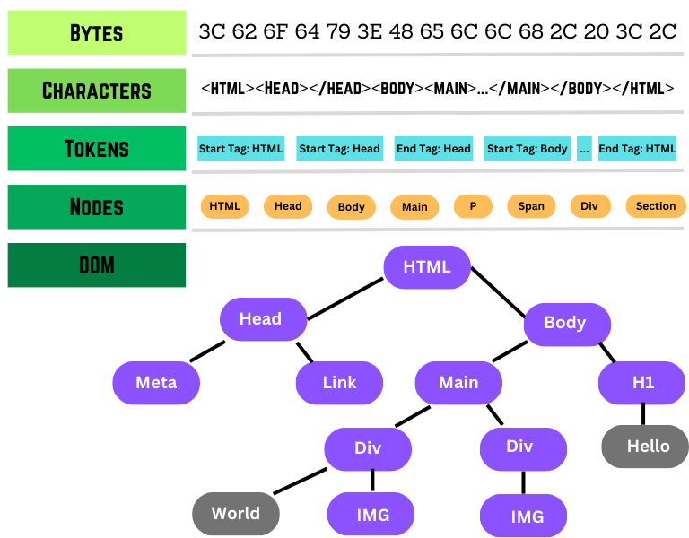
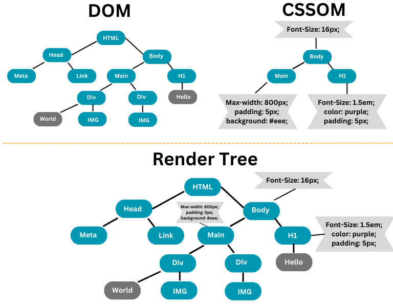
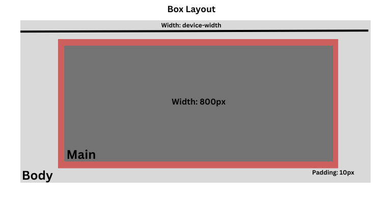

# How a webpage is rendered in the browser
Being a web/frontend developer It is vital to understand how a web page is rendered in the browser because it really helps optimize the application performance.

In each HTTP request that browser makes for an HTML page, the server returns the data into bytes, these bytes are then converted to Characters, Tokens, Nodes, and finally DOM (Document Object Model).

Once the DOM is generated, the parsing of the page starts, the HTML contains CSS code or links, JavaScript code or links, media elements such as images, etc, each of them is then parsed separately and plugged together to create a render tree, which is then converted to the layout and then is painted on the screen at the refresh rate of 60 frames per second.

This complete process is called a critical rendering path. Optimizing the critical rendering path helps to load the web page faster and without glitches or janks.

The complete page rendering can be broken down into 5 different steps:
- Creation of DOM
- Creation of CSSOM
- Formation of Render tree
- Layouting
- Paint

## Creation of DOM
When an HTML is returned as an HTTP response in the browser the data we receive is in bytes, which is then converted to characters, tokens, nodes, and DOM in the order.

The DOM (document object model) is created as the HTML is parsed as a tree-like representation of different HTML nodes. When the HTML is being parsed it encounters styles associated with DOM written inline or imported, script which when loaded can result in the DOM manipulation.

The external elements like scripts and media can be blocked, thus it may halt the HTML parsing until they are completely loaded. That is why it is always advised to load the script at the end or use [defer / async](https://learnersbucket.com/examples/html/how-to-load-script-efficiently-with-async-and-defer/) so that web page is loaded smoothly.

Once the Styles are loaded the CSSOM (CSS object model) is formed which is then matched with their respective HTML element node in the DOM via the browser engine.

## Creating of CSSOM
CSS object model is similar to the DOM in structure but differs in nature. As the DOM stores all the content of the web page, CSSOM stores all the styling information. It blocks the rendering of the webpage until all the CSS style is loaded, parsed, and applied to each DOM node. It is blocking in nature because CSS styles can be overridden.

Each browser engine follows a set of rules for CSS to apply the styles to the corresponding DOM node. The C in the CSS stands for cascade, thus the styles are also cascaded down, which means the child nodes inherit few styles from the parent nodes.

When the browser starts parsing the CSSOM it applies browser-specific styles (user agent) to the nodes as well.

## Formation of Render Tree
Once the DOM and the CSSOM are ready, the browser engine combines them together to create the render tree.

The render tree is constructed by traversing each node in the DOM and attaching its corresponding style from the CSSOM.

The render tree only contains the visible element, for example, if any node style display: none; neither itself nor any of its descendants will be part of the render tree.

## Layout
Once the render tree is ready the layout can be created, the layout is bounded on the device dimension.

The placement of each element is decided through layouting, it decides the dimension of each element as well as their relation to the other elements.

The layout is impacted by the viewport meta tag's definition of the layout viewport's width. Without it, the browser uses the standard viewport width, which on full-screen browsers by default is often 960px. By setting <meta name="viewport" content="width=device-width">, you can force full-screen browsers, like the one on your phone, to use the device's width rather than the viewport's standard width. When a user flips their phone between landscape and portrait mode, the device width changes. Every time a device is rotated or a browser is otherwise resized, the layout takes place.

## Paint the page on the screen
Once the layout is ready, it can be painted pixel by pixel on the screen at the refresh rate of 60fps.

Initially, the entire page will be painted and thereafter if any DOM manipulation occurs only those elements will be reconstructed and painted again.

The more the DOM manipulation, the more the re-rendering of the page, thus we should avoid the frequent DOM changes.